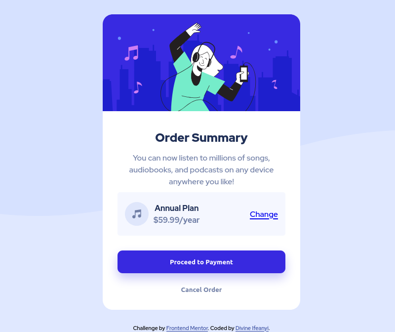

# Frontend Mentor - Order summary card solution

This is a solution to the [Order summary card challenge on Frontend Mentor](https://www.frontendmentor.io/challenges/order-summary-component-QlPmajDUj). Frontend Mentor challenges help you improve your coding skills by building realistic projects. 

## Table of contents

- [The challenge](#the-challenge)
  - [Screenshot](#screenshot)
  - [Links](#links)
- [My process](#my-process)
  - [Built with](#built-with)
  - [What I learned](#what-i-learned)
  - [Continued development](#continued-development)
- [Author](#author)


### The challenge

Users should be able to:

- See hover states for interactive elements

### Screenshot



### Links

- Solution URL: https://divine-hash.github.io/order-summary-component/

## My process

I made sure the project was marked up properly with HTML, and I named the classes so that it will be easy to maintain and modify the css styles.

### Built with

- Semantic HTML5 markup
- CSS custom properties
- Flexbox

### What I learned

To set the height of a body element the html element must have a set height, and the html element inherits its height from the viewport. Giving the html and body element a height of 100% might solve the problem but when the page is scrolled up, the content of the page overflows the body element. Giving the body element a min-height of 100vh(viewport heigt) solves this problem. Setting the width to 100% removes horizontal scroll bars at the bottom if the content of the page is large.

```css
.body {
  width: 100%;
  min-height: 100vh;
}
```

### Continued development

Before I started this project, using wavy svg background images was a mystery to me. I will look into using svg images in my projects.

## Author

- Frontend Mentor - [@Divine-hash](https://www.frontendmentor.io/profile/yourusername)
